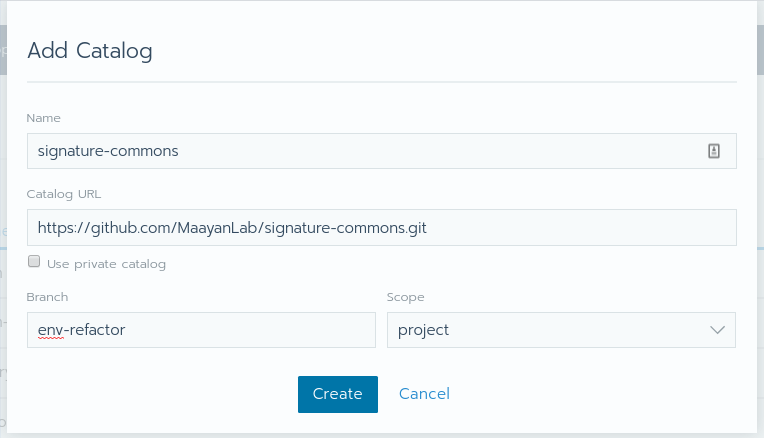
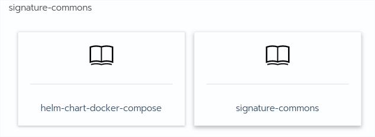
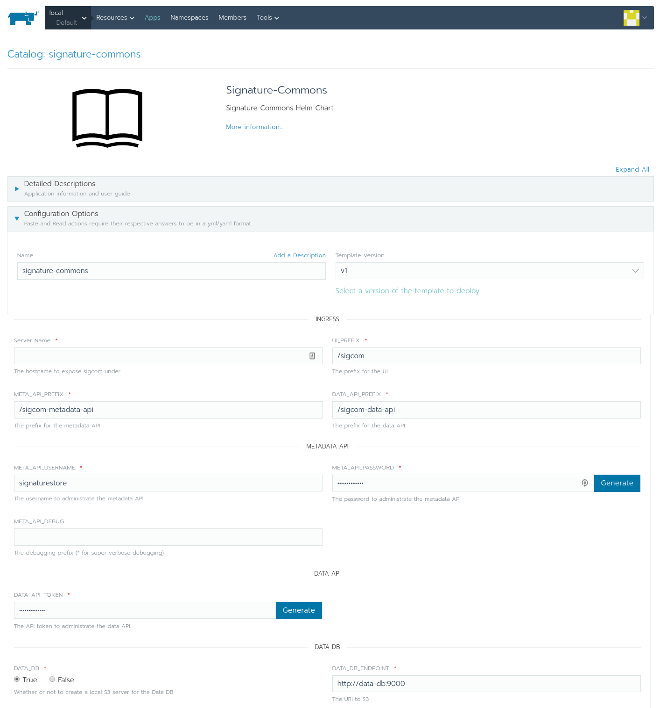
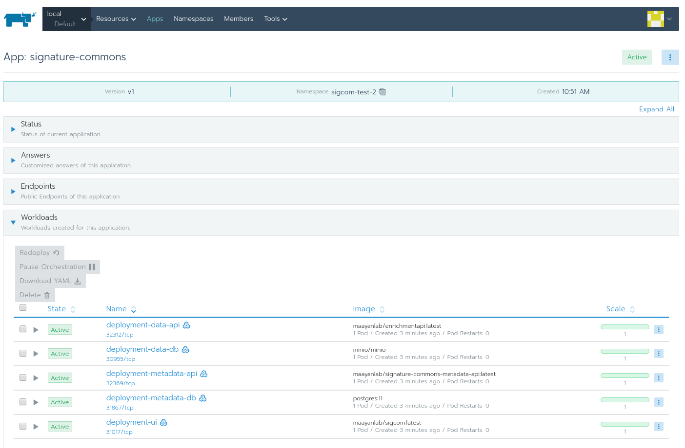

# Helm package

We construct a helm deployment from `docker-compose.*.yml`/`.env.example`.

## Installation

### Helm
Using [this helm github plugin](https://github.com/sagansystems/helm-github) you can use [Helm](https://helm.sh/) to install the signature commons on a [kubernetes](https://kubernetes.io/) cluster.

```bash
helm plugin install --version master https://github.com/sagansystems/helm-github.git
helm github install \
  --repo https://github.com/MaayanLab/signature-commons.git \
  --ref env-refactor --path charts/signature-commons/v1 \
  --namespace signature-commons --generate-name \
  -f signature-commons/v1/values.yaml
```

### Rancher
This repository is formatted in a way that can be used as a [Catalog](https://rancher.com/docs/rancher/v2.x/en/catalog/) in [rancher](https://rancher.com/). See screenshots below:





